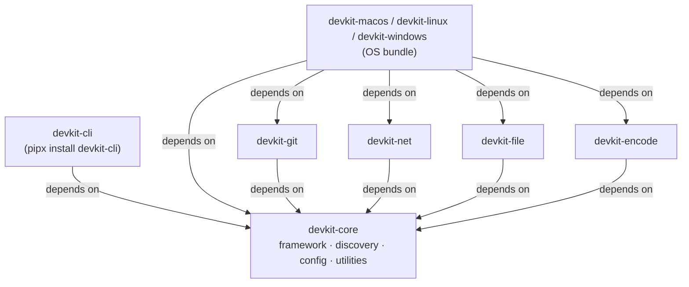
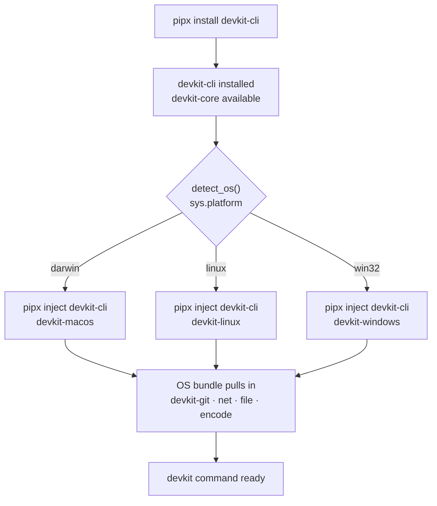
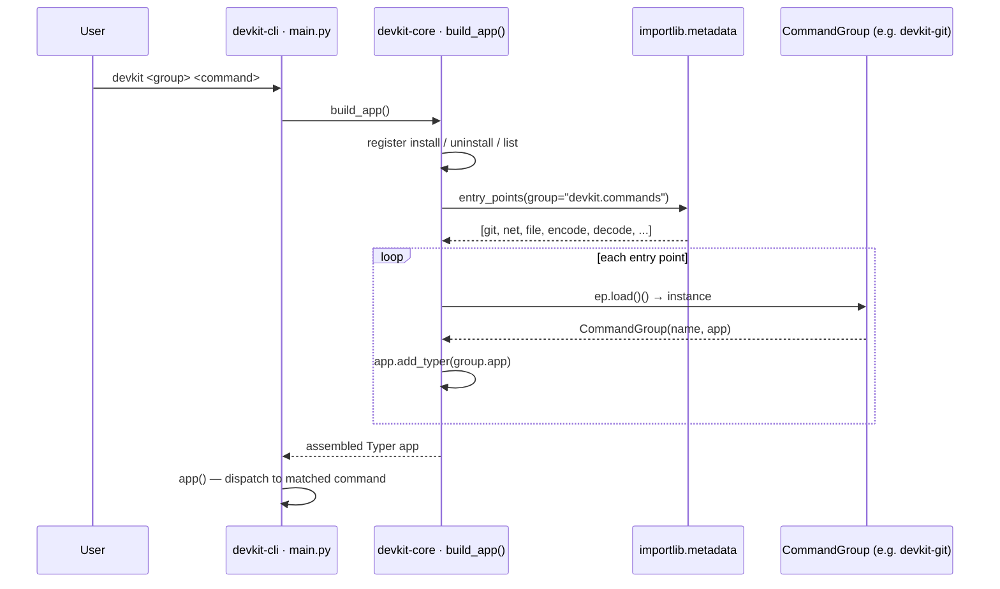
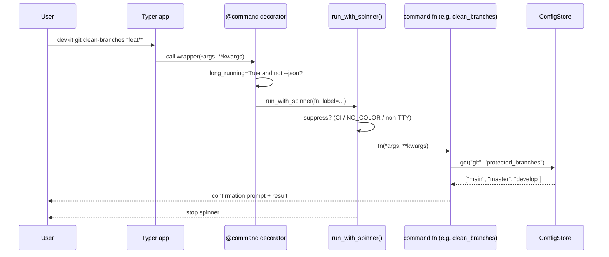

# devkit — Architecture

This document describes how the nine packages that make up devkit relate to each other, how the system is assembled at install time and at runtime, and how a command travels from the terminal to execution.

---

## 1. Package dependency graph

Shows which packages depend on which at install time.

- All command-group plugins depend on `devkit-core`
- OS bundles are convenience aggregators — they depend on `devkit-core` and all default plugins
- `devkit-cli` is the only package a user ever installs directly; it depends only on `devkit-core`



---

## 2. Install-time flow

What happens when a user installs devkit for the first time.

`devkit-cli/src/devkit_cli/installer.py` provides `detect_os()` (uses `sys.platform`) and `detect_install_method()` (checks whether the current executable lives inside `~/.local/pipx/venvs/`).



To add an optional extension afterwards:

```
devkit install devkit-js
```

---

## 3. Runtime startup — plugin discovery

What happens on every `devkit` invocation before any command runs.

`devkit-core/src/devkit_core/app.py` calls `build_app()`, which calls `discover_plugins()` from `devkit-core/src/devkit_core/discovery.py`. Plugin discovery reads all `devkit.commands` entry points registered in the Python environment via `importlib.metadata`, instantiates each `CommandGroup`, and adds each group's `typer.Typer` app as a subcommand group. If two packages register the same entry point name, startup exits with code 2. If a single package fails to load, it is skipped with a warning and the rest of the CLI remains functional.



### Registered entry points (v1)

| Name | Package | Class |
|---|---|---|
| `git` | `devkit-git` | `devkit_git.commands:CommandGroup` |
| `net` | `devkit-net` | `devkit_net.commands:CommandGroup` |
| `file` | `devkit-file` | `devkit_file.commands:CommandGroup` |
| `encode` | `devkit-encode` | `devkit_encode.commands:EncodeCommandGroup` |
| `decode` | `devkit-encode` | `devkit_encode.commands:DecodeCommandGroup` |

---

## 4. Command dispatch — config and spinner

What happens inside a single command invocation, showing the role of `ConfigStore` and the `@command` decorator.

The `@command(long_running=True)` decorator (defined in `devkit-core/src/devkit_core/command.py`) wraps the command function to call `run_with_spinner()` from `devkit-core/src/devkit_core/spinner.py`. The spinner is automatically suppressed when `--json` is set, stdout is not a TTY, or the `CI` / `NO_COLOR` environment variables are present. Config reads go through `ConfigStore` (`devkit-core/src/devkit_core/config.py`), backed by `~/.config/devkit/config.toml`.



